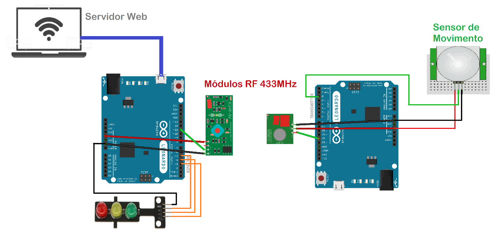

# Control y Monitoreo de Parqueos

_Sistema que nos permtia monitorear la cantidad de vehiculos que entraban a un parqueo y mandarlo a un servidor para que pueda ser visto en una pagina web_



## Introducción

_Este proyecto está dirigido a todos los usuarios de vehículos, para brindarles un buen servicio de estacionamiento a los lugares que cuentan con una mayor afluencia de vehículos, y con el fin de mejorar el bienestar social._

_Objetivos:_
_Se diseñara un circuito para el control de vehículos en un parqueo para el bien de la sociedad en una ciudad en particular._

_Configurar y cargar librerías de Arduino uno que sirvan para la visualización de la información desde cualquier dispositivo con acceso a internet._

_Publicar toda la información recolectada en tiempo real para uso de los usuarios del establecimiento._

## Uso o instalacion 📋

_- Para que el proyecto funcione es necesario tener un arduino conectado al puerto COM de la computadora con el servidor web_

_- Luego si quiere ejecutar el programa en su computadora, use el comando:_


```
npm start
```

## Aclaraciones extras


_Podemos ver los archivos de programacion del microprocesador en la carpeta Arduino Code, asi como tambien el codigo de un trabajo mas que se basaba en comuniacion serial y control de un pequeño motor paso a paso_


## Construido con 🛠️
* [Express](https://expressjs.com/es/) - El framework web usado
* Arduino